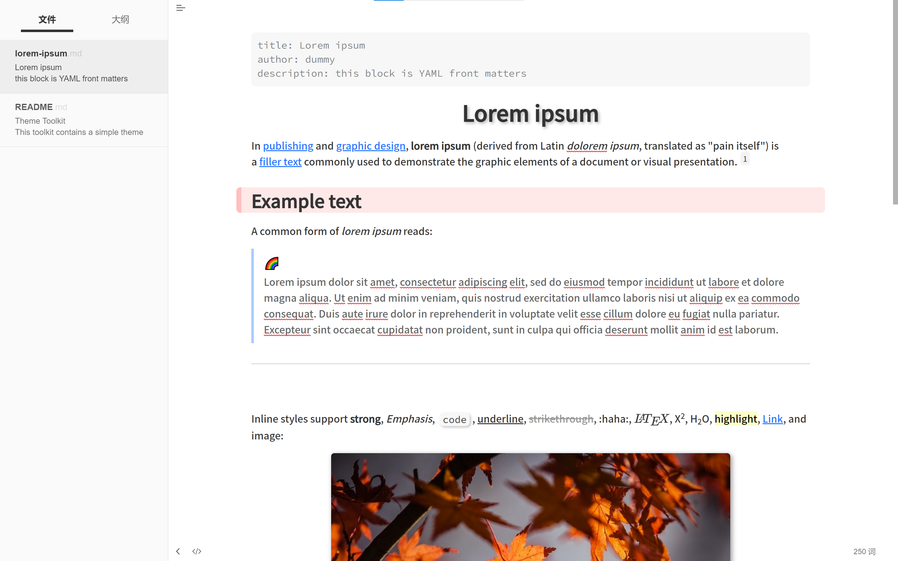
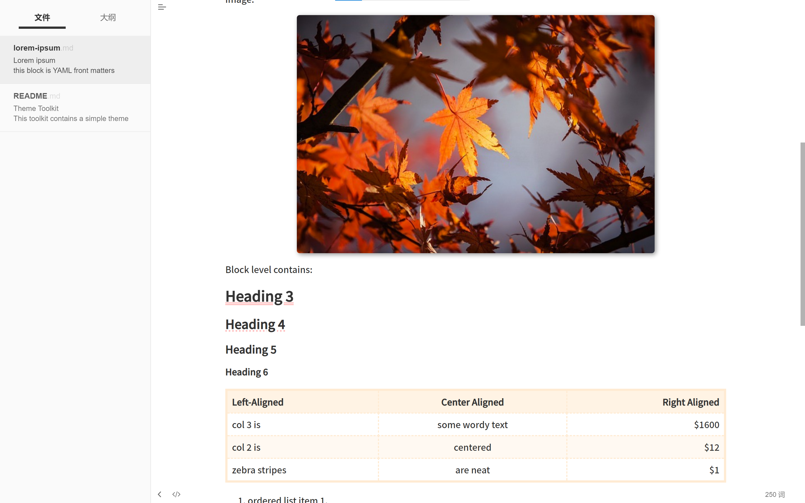
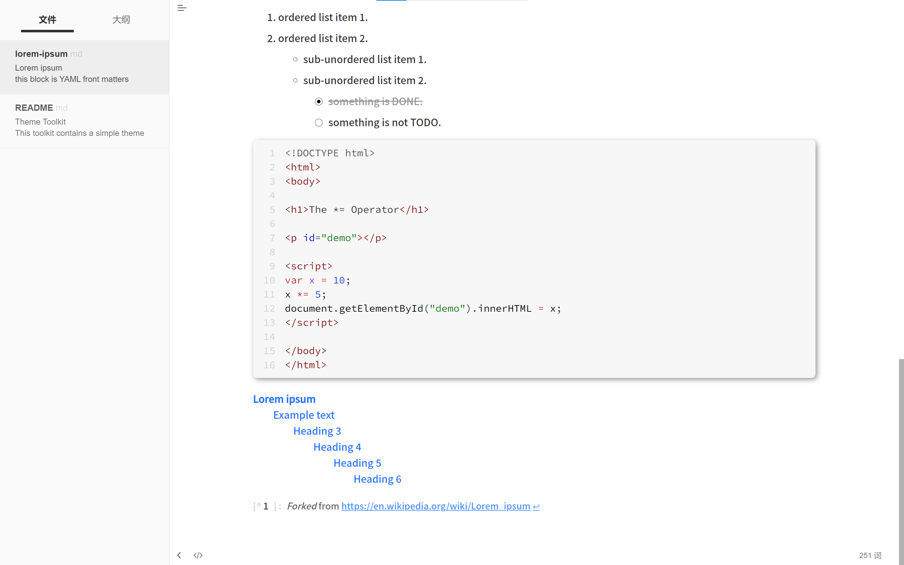

# typora-theme-pie

English | [简体中文](README_zh.md)

[Click]() to visit on *Github*.

## About Rainbow

> A **colorful** and **neat** *Typora* theme.

Inspired by themes:

+ [Liquid](https://github.com/Fentaniao/Liquid)
+ [Maize](https://github.com/BEATREE/typora-maize-theme)
+ [Pie](https://github.com/kevinzhao2233/typora-theme-pie)

Issues are very welcome on *GitHub*.

## Features

+ Well-designed color scheme
+ Tidy fonts
+ Blockquotes with the :rainbow: emojis
+ Image blocks and code blocks with shadow
+ Links and tables with mouse hover effect
+ Checkboxes with smooth transition effect

## How to install

1. Download the **Rainbow.zip** from the [Releases](https://github.com/Fentaniao/Liquid/releases) page and unzip it.
2. Open Theme Folder in Typora from `Preference Panel` → `Appearance` section.
1. Copy **rainbow.css** and the **rainbow** folder into the newly opened folder.
2. Restart typora, then select it from `Themes` menu.

## Thumbnails

