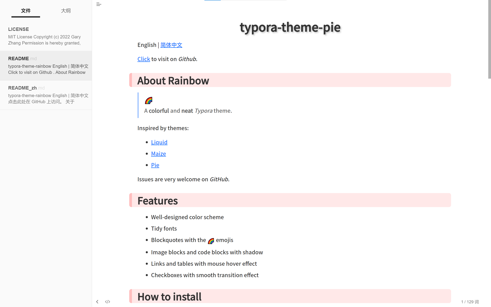

# typora-theme-pie

[English](README.md) | 简体中文

[点击此处](https://github.com/garyzhang2002/typora-theme-rainbow)在*GitHub*上访问。

## 关于Rainbow

> 一个**色彩丰富**并且**干净整洁**的*Typora*主题。

以下主题提供了灵感:

+ [Liquid](https://github.com/Fentaniao/Liquid)
+ [Maize](https://github.com/BEATREE/typora-maize-theme)
+ [Pie](https://github.com/kevinzhao2233/typora-theme-pie)

欢迎在*GitHub*上提Issue。

## 特性

+ 精心设计的配色方案
+ 整洁的字体
+ 引用块带有 :rainbow: 符号
+ 图片和代码块带有阴影样式
+ 链接和图标带有鼠标悬停效果
+ 清单列表带有顺滑的动画效果

## 如何安装

1. Download the **Rainbow.zip** from the [Releases](https://github.com/Fentaniao/Liquid/releases) page and unzip it.
2. Open Theme Folder in Typora from `Preference Panel` → `Appearance` section.
3. Copy **rainbow.css** and the **rainbow** folder into the newly opened folder.
4. Restart typora, then select it from `Themes` menu.

## Thumbnails

